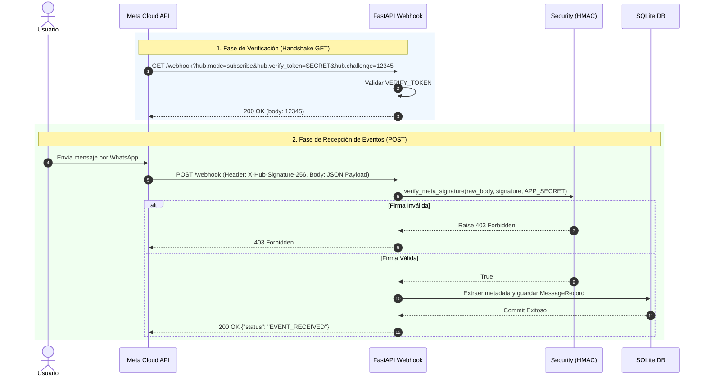

# 🟢 WhatsApp Business API Webhook (FastAPI + SQLite + GCP Cloud Run)

Bienvenido a esta guía educativa para construir, probar y desplegar un servidor Webhook para la **WhatsApp Business Cloud API** (Meta Graph API) utilizando **Python**, **FastAPI**, **SQLAlchemy** y **Docker**.

Este proyecto está diseñado con estándares de arquitectura limpia y seguridad de grado de producción, siendo ideal para aprender cómo se integran las aplicaciones modernas con ecosistemas de APIs de Meta y Google Cloud Platform (GCP).

---

## 📚 Table of Contents
1. [¿Qué es un Webhook y cómo funciona?](#-qué-es-un-webhook-y-cómo-funciona)
2. [Diagrama de Arquitectura y Flujo de Datos](#-diagrama-de-arquitectura-y-flujo-de-datos)
3. [Seguridad: Explicación Línea por Línea de HMAC-SHA256](#-seguridad-explicación-línea-por-línea-de-hmac-sha256)
4. [Estructura del Proyecto](#-estructura-del-proyecto)
5. [Requisitos Previos y Configuración de `.env`](#-requisitos-previos-y-configuración-de-env)
6. [Guías de Despliegue](#-guías-de-despliegue)

---

## 💡 ¿Qué es un Webhook y cómo funciona?

Un **Webhook** es un patrón de comunicación entre aplicaciones orientado a eventos. A diferencia de las APIs tradicionales donde tu aplicación consulta periódicamente a un servidor ("Polling") para saber si hay datos nuevos, un Webhook invierte el proceso: **Meta envía una petición HTTP POST a tu servidor en tiempo real cada vez que ocurre un evento** (por ejemplo, cuando un usuario te envía un mensaje de texto o una imagen por WhatsApp).

### Ciclo de vida con la WhatsApp Cloud API:

1. **Handshake inicial (GET /webhook):**
   - Cuando configuras la URL en el panel de Meta Developers, Meta realiza una petición `GET` a tu endpoint con tres parámetros en la URL:
     - `hub.mode=subscribe`
     - `hub.verify_token`: Un token secreto que defines tú.
     - `hub.challenge`: Un número aleatorio enviado por Meta.
   - Tu servidor verifica que el `hub.verify_token` sea correcto y devuelve el valor entero de `hub.challenge` en texto plano con código HTTP 200. Con esto Meta confirma que la URL existe y es de tu propiedad.

2. **Recepción de Eventos en Tiempo Real (POST /webhook):**
   - Cuando llega un mensaje, Meta realiza un `POST` con la carga útil (JSON payload) que contiene detalles del mensaje y del usuario.
   - Tu servidor **valida la firma criptográfica HMAC-SHA256** del header `X-Hub-Signature-256` para garantizar que la solicitud proviene auténticamente de Meta y no de un impostor.
   - Procesas el mensaje, lo almacenas en la base de datos y retornas **HTTP 200 inmediatamente** (`{"status": "EVENT_RECEIVED"}`).
   - *Nota vital:* Debes responder en menos de 20 segundos; de lo contrario, Meta asumirá un fallo de red y reintentará el envío repetidamente.

---

## 📐 Diagrama de Arquitectura y Flujo de Datos



---

## 🔒 Seguridad: Explicación Línea por Línea de HMAC-SHA256

Para evitar ataques de falsificación de solicitudes entre sitios (CSRF) o inyección de eventos maliciosos, Meta firma cada solicitud HTTP POST utilizando el código secreto de la aplicación (`APP_SECRET`) y el algoritmo **HMAC con SHA-256**.

A continuación se analiza en detalle el código del archivo `app/security.py`:

```python
import hmac
import hashlib
from fastapi import HTTPException, status
from app.config import logger

def verify_meta_signature(payload_bytes: bytes, signature_header: str | None, app_secret: str) -> bool:
    # 1. Comprobar que el encabezado existe en la solicitud HTTP
    if not signature_header:
        logger.warning("Firma ausente: Falta el header X-Hub-Signature-256.")
        raise HTTPException(
            status_code=status.HTTP_403_FORBIDDEN,
            detail="Falta el encabezado de firma X-Hub-Signature-256."
        )

    # 2. Verificar que la firma empiece con el prefijo oficial 'sha256='
    if not signature_header.startswith("sha256="):
        logger.warning("Firma malformada: No inicia con sha256=.")
        raise HTTPException(
            status_code=status.HTTP_403_FORBIDDEN,
            detail="Formato de firma invalido. Se esperaba sha256=<hash>."
        )

    # 3. Separar el prefijo 'sha256=' para obtener solo el Hash Hexadecimal enviado por Meta
    expected_hash = signature_header.split("sha256=", 1)[1].strip()

    # 4. Convertir el APP_SECRET (cadena de texto) a un arreglo de bytes UTF-8
    secret_bytes = app_secret.encode("utf-8")

    # 5. Recalcular el hash localmente usando el cuerpo bruto del mensaje (payload_bytes)
    #    Es fundamental usar el cuerpo en bytes tal cual se recibió antes de decodificar el JSON.
    mac = hmac.new(key=secret_bytes, msg=payload_bytes, digestmod=hashlib.sha256)
    calculated_hash = mac.hexdigest()

    # 6. Comparación en tiempo constante para mitigar ataques de temporización (Timing Attacks)
    if not hmac.compare_digest(expected_hash, calculated_hash):
        logger.error("Firma invalida: Hash calculado no coincide con Meta.")
        raise HTTPException(
            status_code=status.HTTP_403_FORBIDDEN,
            detail="Firma HMAC-SHA256 invalida. Solicitud no autorizada."
        )

    return True
```

### 🔑 Puntos Clave de Seguridad:
- **`payload_bytes`:** Debe usarse el arreglo de bytes original sin ningún tipo de preprocesamiento o formateo de JSON. Cambiar un solo espacio en blanco alteraría completamente el hash resultante.
- **`hmac.compare_digest()`:** A diferencia del operador convencional `==`, esta función compara las cadenas en tiempo constante, evitando que un atacante deduzca caracteres correctos analizando nanosegundos de respuesta del servidor.

---

## 📁 Estructura del Proyecto

```text
csa-business-agent/
│
├── app/
│   ├── __init__.py           # Inicialización del módulo Python
│   ├── config.py             # Configuración central con pydantic-settings
│   ├── database.py           # Modelos SQLAlchemy y conexión a SQLite
│   ├── main.py               # Aplicación FastAPI, rutas de Webhook y Dashboard
│   ├── security.py           # Lógica de validación HMAC-SHA256
│   └── whatsapp_client.py    # Cliente HTTP (httpx) para enviar mensajes por Meta Graph API
│
├── templates/
│   └── dashboard.html        # Interfaz de usuario minimalista (Jinja2 + Tailwind CDN)
│
├── tests/
│   └── test_webhook.py       # Pruebas unitarias de integración con pytest
│
├── .env.example              # Plantilla de variables de entorno
├── Dockerfile                # Configuración de contenedor optimizada
├── Procfile                  # Comando de punto de entrada para GCP Buildpacks
├── requirements.txt          # Dependencias de Python
├── deploy_local.md           # Guía paso a paso para entorno local (Docker + Tunnel)
└── deploy_gcp.md             # Guía paso a paso para entorno producción (GCP Cloud Run)
```

---

## ⚙️ Requisitos Previos y Configuración de `.env`

Copia el archivo `.env.example` a `.env` y completa los valores obtenidos de tu **Meta Developer Dashboard**:

```bash
cp .env.example .env
```

Contenido del archivo `.env`:

| Variable | Descripción | Ejemplo |
| :--- | :--- | :--- |
| `VERIFY_TOKEN` | Token personalizado para el handshake de verificación. | `mi_token_secreto_123` |
| `APP_SECRET` | Clave secreta de la app en Meta Developers (Configuración básica). | `a1b2c3d4e5f67890...` |
| `WHATSAPP_TOKEN` | Token de acceso temporal o permanente para la Graph API. | `EAABxxxx...` |
| `PHONE_NUMBER_ID` | ID del número telefónico de prueba en la consola de WhatsApp. | `109876543210987` |
| `DATABASE_URL` | Cadena de conexión SQLAlchemy (predeterminado SQLite). | `sqlite:///./whatsapp_messages.db` |
| `LOG_LEVEL` | Nivel de verbosidad de logs (`INFO`, `DEBUG`, `WARNING`). | `INFO` |

---

## 📖 Guías de Despliegue

Sigue nuestras guías detalladas para ejecutar el proyecto en tu máquina local o desplegarlo a la nube:

- 💻 **Entorno Local (Windows 11 / macOS / Linux):** Consulta [`deploy_local.md`](./deploy_local.md) para ejecutar con Docker Desktop y exponer tu puerto local mediante un túnel HTTPS (`ngrok` / `cloudflared`).
- ☁️ **Entorno de Producción (Google Cloud Run):** Consulta [`deploy_gcp.md`](./deploy_gcp.md) para un despliegue Serverless de costo cero/mínimo usando Cloud Run y Secret Manager.

